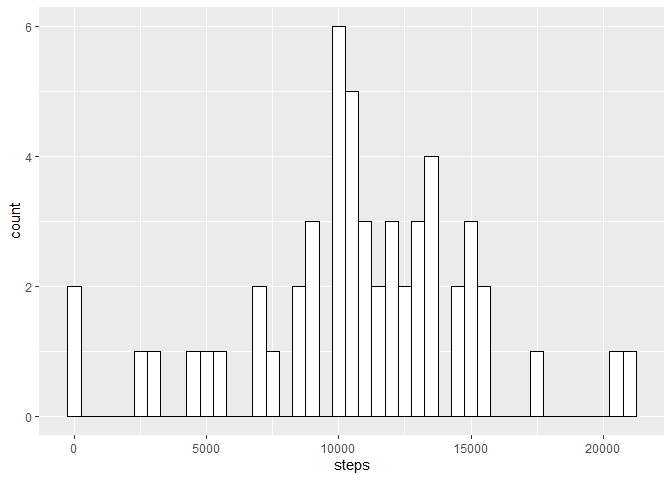
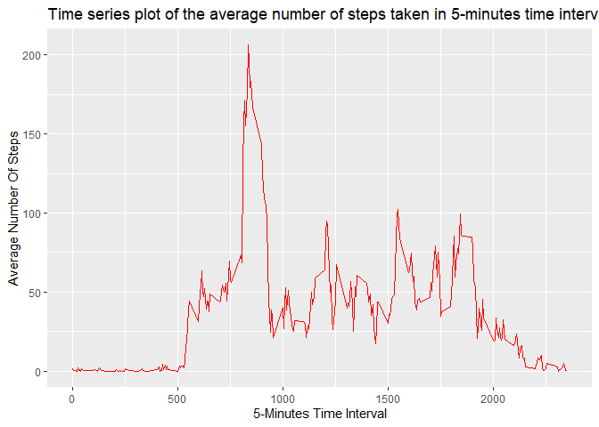
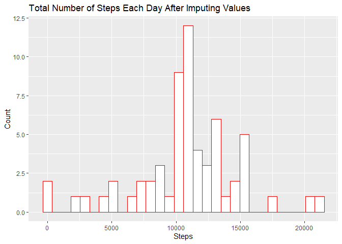
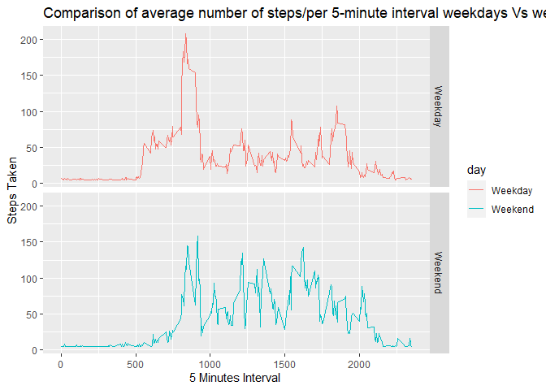

### Load Packages and Libraries

```r
library(ggplot2)
```

```
## Warning: package 'ggplot2' was built under R version 3.6.3
```
### Loading and preprocessing the data

### 1.Reading File


```r
activity_data<-read.csv("activity.csv", header=TRUE)
head(activity_data)
```

```
##   steps       date interval
## 1    NA 2012-10-01        0
## 2    NA 2012-10-01        5
## 3    NA 2012-10-01       10
## 4    NA 2012-10-01       15
## 5    NA 2012-10-01       20
## 6    NA 2012-10-01       25
```


### What is mean total number of steps taken per day?

### 2. Histogram of the total number of steps taken each day


```r
per_day_steps<- aggregate(steps ~ date, activity_data, sum, na.rm=TRUE)
ggplot(per_day_steps, aes(x=steps)) + geom_histogram(binwidth=500,color="black", fill="white")
```

<!-- -->

### 3. Mean and median of number of steps taken each day

```r
mean_total<-mean(per_day_steps$steps, na.rm=TRUE)
median_total<-median(per_day_steps$steps, na.rm=TRUE)
```

### Mean of number of steps taken each day :

```r
round(mean_total)
```

```
## [1] 10766
```

### Median of number of steps taken each day :

```r
round(median_total)
```

```
## [1] 10765
```

### What is the average daily activity pattern?


### Time series plot of the average number of steps taken in 5-minutes time interval

```r
active_activity_data<-activity_data[complete.cases(activity_data),]

avg5min_steps<-aggregate(steps~interval, active_activity_data, mean)

ggplot(avg5min_steps, aes(interval, steps, type = "l")) + 
    geom_line(color="red") + 
    xlab("5-Minutes Time Interval") +
    ylab("Average Number Of Steps") +
    ggtitle("Time series plot of the average number of steps taken in 5-minutes time interval")
```

<!-- -->


### 5. The 5-minute interval that, on average, contains the maximum number of steps

```r
max_steps_interval<-which.max(avg5min_steps$steps)
max_steps_interval
```

```
## [1] 104
```

```r
print (paste("Interval with the highest average number of steps is ", avg5min_steps[max_steps_interval, ]$interval, " and the no of steps for that interval is ", round(avg5min_steps[max_steps_interval, ]$steps, digits = 0)))
```

```
## [1] "Interval with the highest average number of steps is  835  and the no of steps for that interval is  206"
```
### Imputing missing values

### 6. Code to describe and show a strategy for imputing missing data

```r
#Find Missing Values
missing_values_data<-activity_data[!complete.cases(activity_data),]
print(paste("Total rows with missing value are :", nrow(missing_values_data)))
```

```
## [1] "Total rows with missing value are : 2304"
```

```r
#Find rows with NA and imputing missing values with the mean 
impute_activity_data<-activity_data
impute_activity_data$steps[is.na(impute_activity_data$steps)]<-mean(impute_activity_data$steps, na.rm=TRUE)

#Check if there is any NA value left

impute_activity_data$steps <- as.numeric(impute_activity_data$steps)
impute_activity_data$interval <- as.numeric(impute_activity_data$interval)
colSums(is.na(impute_activity_data))
```

```
##    steps     date interval 
##        0        0        0
```

```r
# New data with filled values
summary(impute_activity_data)
```

```
##      steps                date          interval     
##  Min.   :  0.00   2012-10-01:  288   Min.   :   0.0  
##  1st Qu.:  0.00   2012-10-02:  288   1st Qu.: 588.8  
##  Median :  0.00   2012-10-03:  288   Median :1177.5  
##  Mean   : 37.38   2012-10-04:  288   Mean   :1177.5  
##  3rd Qu.: 37.38   2012-10-05:  288   3rd Qu.:1766.2  
##  Max.   :806.00   2012-10-06:  288   Max.   :2355.0  
##                   (Other)   :15840
```
### 7. Histogram of the total number of steps taken each day after missing values are imputed

```r
impute_steps_daily<-aggregate(steps~date, impute_activity_data, sum)
ggplot(impute_steps_daily, aes(x=steps)) + geom_histogram(color="red", fill="white") +
  ggtitle("Total Number of Steps Each Day After Imputing Values")+
  xlab("Steps")+
  ylab("Count")
```

```
## `stat_bin()` using `bins = 30`. Pick better value with `binwidth`.
```

<!-- -->

### Are there differences in activity patterns between weekdays and weekends?

### 8. Panel plot comparing the average number of steps taken per 5-minute interval across weekdays and weekends

```r
# create a factor variable having 2 labels( Weekday and Weekend)
library(timeDate)
```

```
## Warning: package 'timeDate' was built under R version 3.6.3
```

```r
impute_activity_data$day <- ifelse (isWeekday(impute_activity_data$date),"Weekday", "Weekend")
plot_data<-aggregate(steps~interval+day, impute_activity_data, mean)


# PLOT

ggplot(plot_data, aes(interval, steps, color=day), type="l")+
  geom_line()+
  facet_grid(day~.)+ 
  xlab("5 Minutes Interval ")+
  ylab("Steps Taken")+
  ggtitle("Comparison of average number of steps/per 5-minute interval weekdays Vs weekends")
```

<!-- -->

